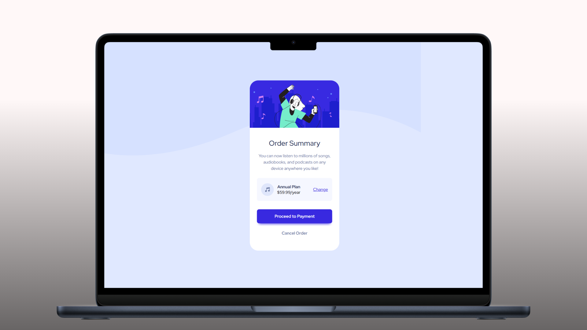

<h1 align="center">Order Summary Component</h1>

<p align="left">
  <a href="README_ES.md" target="_blank">
    Ver README en Español
  </a>
</p>

<p>
  This project is a solution to the "Order Summary Component" challenge from Frontend Mentor. It was developed as a practical exercise to reinforce core HTML and CSS skills, with a particular focus on semantic HTML structure, the BEM (Block, Element, Modifier) methodology, and the effective use of Flexbox for layout. It offers an excellent opportunity for beginners to build confidence in crafting clean, structured web components.
</p>

<hr>

<h1 align="center">Technologies Used</h1>

<div align="center">
  
  
</div>

<hr>

<h1 align="center">Objective</h1>

<p>
  The main goal of this project is to practice building clean, responsive layouts using modern frontend techniques. Flexbox was used to achieve a structured and adaptive layout, while the BEM methodology helped organize the CSS code in a modular and maintainable way. The component is designed to be simple yet visually polished, making it a great foundation for future projects.
</p>

<hr>

<h1 align="center">Main Features</h1>

<ul>
  <li><b>BEM Methodology:</b> Clear and modular CSS architecture following the BEM convention, making the codebase easier to scale and maintain.</li>
  <li><b>Responsive Layout:</b> Layout built with Flexbox for effective alignment and adaptability across various screen sizes.</li>
</ul>

<hr>

<h1 align="center">Skills Acquired</h1>

<ul>
  <li>Enhanced understanding of semantic HTML and structured markup.</li>
  <li>Practical application of the BEM methodology for scalable CSS development.</li>
  <li>Hands-on experience with Flexbox for building efficient and responsive UI components.</li>
</ul>

<hr>

<h1 align="center">How to Use</h1>

1. Clone this repository to your local machine:

   ```sh
   git clone https://github.com/jordanmedinaortiz/order-summary-component.git
   cd order-summary-component
2. Open the index.html file in your preferred web browser.

3. Explore the component and observe how layout and CSS best practices were implemented.

<p> This project has been a great opportunity to solidify essential web development skills. It serves as an ideal starting point for beginners, and the use of clear documentation and good practices ensures an effective learning experience. </p>
<p> You can view the live project demo <a href="https://jordanmedinaortiz.github.io/order-summary-component/" target="_blank">here</a>.
</p> 
